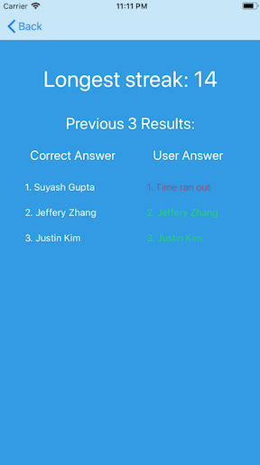

# Member Match

iOS game to learn the names of the members in Mobile Developers of Berkeley.

User has 5 seconds to match the picture of a MDB member to the correct name out of 4 possible options. The correct answer is highlighted in green and the chosen answer will be highlighted in red if it is wrong. If the timer hits 0, it is counted as an incorrect answer and the streak resets. The statistics page shows the user's longest streak and the results for the last 3 answers.

{:height="50%" width="50%"}
{:height="50%" width="50%"}
{:height="50%" width="50%"}
